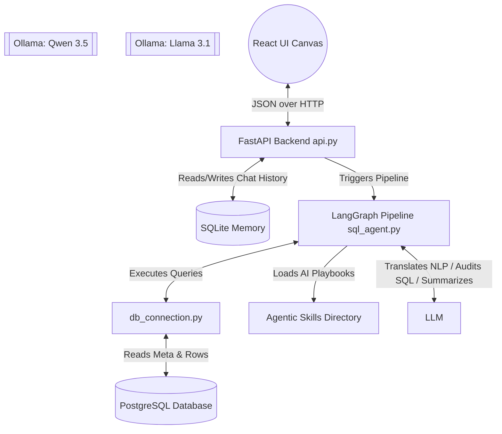

# Embrix Conversational BI Agent - Architecture

This document outlines the architecture and modules of the AI-powered conversational business intelligence tool for the PostgreSQL Embrix database.

## System Architecture

The application is built on local services (Python, local PostgreSQL, local SQLite, Ollama/Llama 3.1) alongside Ollama/Qwen3.5 for the SQL generation. The system uses a multi-agent LangGraph orchestration pipeline communicating with a sleek React frontend.

---

## Core Modules

### 1. React Frontend UI (`frontend/src/App.jsx`)
A sleek, glassmorphic conversational interface built with Vite and React.
*   **Chat Canvas**: Displays the conversational history, SQL used, and thought processing times. Maps AI-suggested business questions (`msg.follow_ups`) into interactive, clickable UI pills.
*   **Empty Table Detection**: On initial load, the UI fetches a list of empty tables from the backend and displays them as a global, dismissible dropdown banner on the canvas to prevent querying dead data.
*   **SQL Editor**: Allows users to view the generated SQL, manually edit it, and force a bypassed "Rerun" directly to the Auditor.
*   **Dynamic Charting**: Uses `recharts` to render Bar, Line, or Pie charts based on JSON specs generated by the AI Dashboard node.

### 2. FastAPI Orchestration Layer (`api.py`)
Serves as the bridge between the UI and the AI engine.
*   **Session Management**: Manages chat sessions utilizing SQLite (`memory.py`) to persist context.
*   **`/schema/empty_tables` Endpoint**: Exposes the database profiling logic to the frontend to warn users of empty tables.
*   **`/query` & `/query/rerun` Endpoints**: Compiles rolling chat history and executes the LangGraph agent state machine. Computes total backend processing duration to return an exact `--thought for X seconds--` label to the UI.

### 3. LangGraph Multi-Agent Pipeline (`sql_agent.py`)
A state-machine orchestration engine containing multiple distinct AI nodes.
*   **Generation Node**: Uses the database schema, Knowledge Graph, and rolling chat history to generate a PostgreSQL query.
*   **Audit Node**: An independent LLM node strictly tasked with analyzing the generated (or user-edited) SQL for destructive DML commands or security risks. Will reject and trigger a retry if rules are violated.
*   **Execution Node**: Runs the validated SQL using `pandas` and captures the data.
*   **Response Node**: Ingests the tabular data and chat history, then applies the `business-analyst` skill playbook to generate a conversational natural language summary. Strictly outputs a JSON payload containing the `response` string and a `follow_ups` array (exactly 2 clickable business questions).
*   **Dashboard Node**: Evaluates the tabular data shape and outputs a declarative JSON spec (e.g., `type: "bar", x: "date", y: "sales"`) for the frontend to render.

### 4. Database Connection Layer (`db_connection.py`)
*   **Global Schema Discovery**: Extracts metadata from the PostgreSQL information schema.
*   **Data Profiling**: Executes pre-query `COUNT(*)` checks to categorize tables. Empty tables are aggressively pruned from the prompt context to prevent hallucinations.

### 5. Knowledge Graph Inference (`infer_schema.py`)
*   **AI Relationship Inference**: Because foreign key constraints are often missing, this standalone script uses Llama 3.1 to logically deduce joins.
*   **Graph Serialization**: Constructs a `networkx` directed graph representing table relationships, which the LangGraph Generation Node uses for context.
