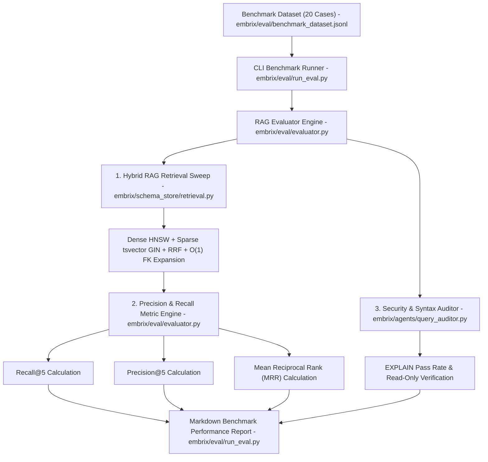
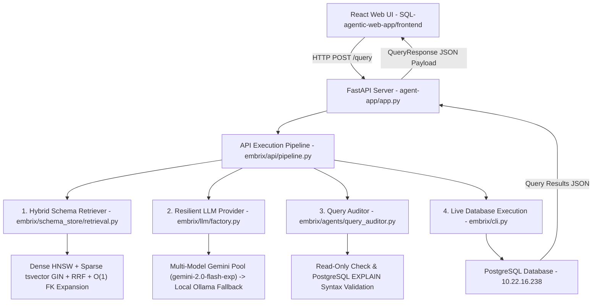
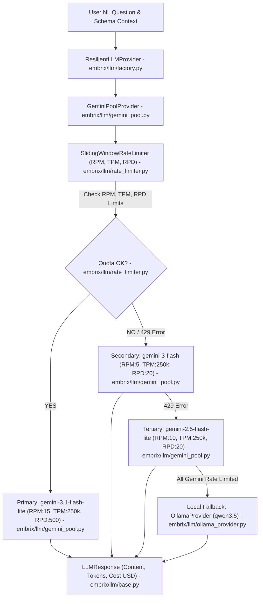
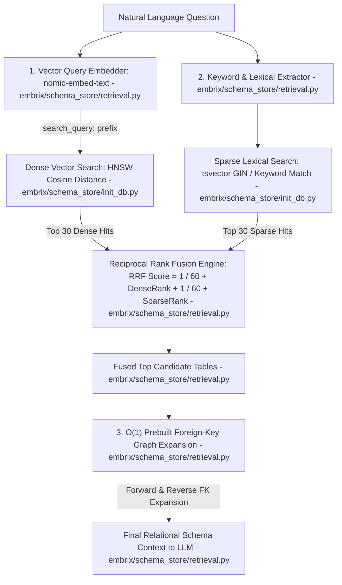
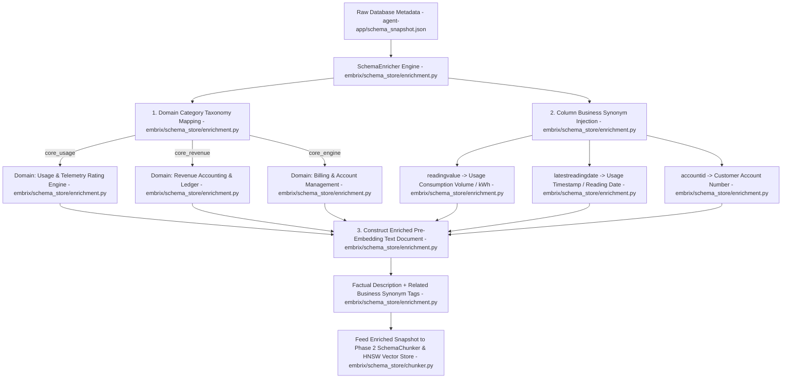
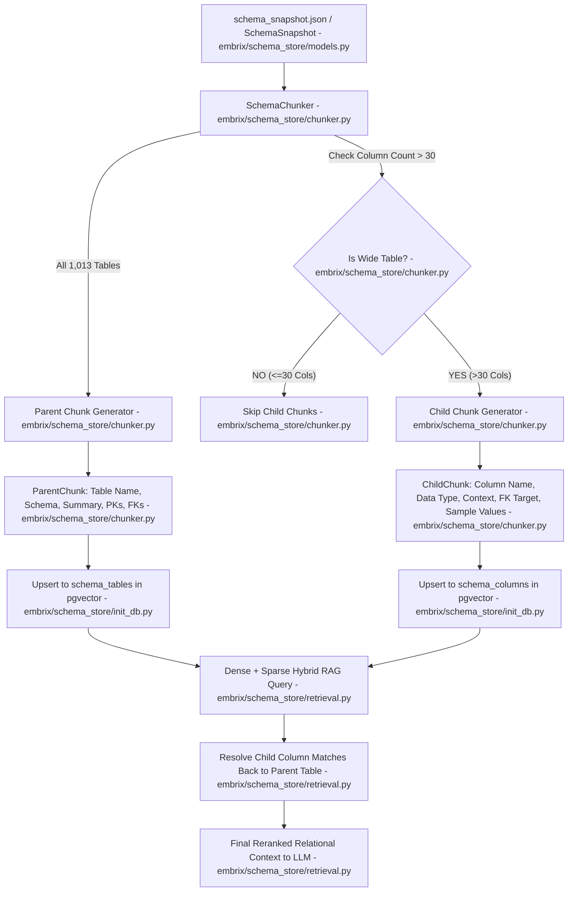

# Embrix AI Codebase Documentation

This document provides extremely detailed documentation of every single file within the `keen-einstein` project workspace, including the CLI agent, the web application, config files, modules, and the newly established `agent-app/` active development directory.

## Root Directory (`/`)

* **`README.md`**
  * **Purpose & Architecture:** The main entry point documentation for the overall project.
  * **Role in System:** Explains high-level goals of the Embrix Conversational Analytics system.
* **`AGENTS.md`**
  * **Purpose & Architecture:** Embrix AI Agent Directives containing zero-scratch-file protocols, required output formats (SQL + Markdown table + Token Cost), and read-only (SELECT) enforcement rules.
  * **Role in System:** Essential instruction manual used by LLM agents acting within the workspace.
* **`architecture_tradeoff_breakdown.txt`**
  * **Purpose & Architecture:** Text file documenting technical choices, why certain database and agentic frameworks were chosen, and their performance tradeoffs.
* **`miscel.md`**
  * **Purpose & Architecture:** Miscellaneous developer notes and scratchpad ideas for system expansions.
* **`.gitignore`**
  * **Purpose & Architecture:** Standard Git ignore file protecting `.env`, `venv`, `__pycache__`, and SQLite artifacts from being committed.

---

## agent-app (`/agent-app/`)
*Clean active application folder hosting REST API, multi-model Gemini rate limiting, and pgvector RAG development.*

### Configs & Core Package
* **`.env`**: Active environment variables for DB connections, LLM APIs, and embedding settings.
* **`.env.example`**: Environment variable template for team onboarding (PostgreSQL creds, Gemini API Key, Ollama base URL, ports).
* **`WALKTHROUGH.md`**: Complete end-to-end beginner guide explaining system goals, file-by-file functions, simple examples, system diagrams, and setup instructions.
* **`RATE_LIMITER_EXPLANATION.md`**: Deep-dive technical explanation of the multi-dimensional Sliding Window Log Rate Limiter algorithm.
* **`RAG_EVALUATION_EXPLANATION.md`**: Detailed architectural guide explaining the RAG benchmark evaluation suite, formulas, and frontend connection.
* **`AGENTS.md`**: Directives and output protocols for the active application workspace.

* **`README.md`**: Setup and execution instructions for `agent-app`.
* **`nl2sql_validation_plan.md`**: Plan for Natural Language to SQL validation pipelines.
* **`schema_drift_workflow.md`**: Design doc explaining schema drift detection and synchronization.
* **`schema_snapshot.json`**: A static, in-memory representation of the full schema metadata.
* **`embrix_meta.db`**: Local SQLite metadata store fallback.

### `embrix/` (Main Python Package)
* **`__init__.py`**: Exposes the package modules.
* **`cli.py`**
  * **Purpose:** Command Line Interface handling query parsing, schema context, and inference pipeline.
  * **Key Functions:** `calculate_token_usage()`, `call_ollama_llm()`, `generate_sql_from_schema()`, `run_pipeline()`.

#### `embrix/agents/` (Agentic Tools)
* **`__init__.py`**: Exposes agent functionalities.
* **`query_auditor.py`**
  * **Purpose:** Ensures database safety (read-only enforcement) and valid SQL syntax.
  * **Role in System:** Intercepts generated SQL. If it contains DML/DDL, provides feedback for auto-retry.

#### `embrix/eval/` (RAG Evaluation Framework & Benchmark Suite)
* **`__init__.py`**: Exposes evaluation suite modules.
* **`benchmark_dataset.jsonl`**
  * **Purpose:** Gold-standard benchmark dataset containing 20 curated natural language questions across `core_usage`, `core_revenue`, `core_engine`, `core_oms`, `core_pricing`, `core_mediation`, and `core_config` with target table ground truths.
* **`evaluator.py`**
  * **Purpose:** `RAGEvaluator` engine calculating **Recall@K**, **Precision@K**, **Mean Reciprocal Rank (MRR)**, **EXPLAIN Pass Rate**, and latency metrics.
* **`run_eval.py`**
  * **Purpose:** CLI benchmark runner executing automated RAG evaluation sweeps and formatting terminal output tables.

### Phase 7 RAG Evaluation Framework Flow Diagram

#### `app.py` & `embrix/api/` (Production REST API & UI Integration)
* **`app.py`**
  * **Purpose:** FastAPI REST API Application server.
  * **Role in System:** Serves endpoints for `SQL-agentic-web-app/frontend` (`/query`, `/query/rerun`, `/sessions`, `/schema/empty_tables`, `/suggested_questions`, `/health`).
* **`embrix/api/schemas.py`**
  * **Purpose:** Pydantic DTO data models (`QueryRequest`, `QueryResponse`, `SessionRequest`, `HealthResponse`).
* **`embrix/api/pipeline.py`**
  * **Purpose:** Production NL-to-SQL Execution Pipeline connecting Hybrid RAG Retrieval, Resilient LLM Pool, QueryAuditor, and PostgreSQL data fetching.

### Phase 6 System Architecture & REST API Flow Diagram

#### `embrix/llm/` (Decoupled LLM Provider Abstraction & Multi-Dimensional Rate Limiter Pool)
* **`__init__.py`**: Exposes LLM provider modules.
* **`base.py`**
  * **Purpose:** Abstract Base Class (`BaseLLMProvider`) and standardized response wrapper (`LLMResponse`).
* **`rate_limiter.py`**
  * **Purpose:** Thread-safe `SlidingWindowRateLimiter` enforcing **RPM (Requests/Min)**, **TPM (Tokens/Min)**, and **RPD (Requests/Day)** sliding-window quota limits.
* **`gemini_pool.py`**
  * **Purpose:** `GeminiPoolProvider` managing round-robin rotation across free Gemini models:
    - **`gemini-3.1-flash-lite`** (Primary): RPM=15, TPM=250k, RPD=500
    - **`gemini-3-flash`** (Secondary): RPM=5, TPM=250k, RPD=20
    - **`gemini-2.5-flash-lite`** (Tertiary): RPM=10, TPM=250k, RPD=20
  * **Role in System:** Multi-model pool with automatic failover on HTTP 429 or quota exhaustion.
* **`ollama_provider.py`**
  * **Purpose:** Local `OllamaProvider` (`qwen3.5` / `llama.cpp` local endpoints).
  * **qwen3.5** model architecture:        
    * Parameters:          9.7B
    * Context length:      262144
    * Embedding length:    4096
    * Quantization:        Q4_K_M
    * Requires:            0.17.1

  * **qwen3.5** Parameters
    * Presence_penalty:    1.5
    * Temperature:         1
    * Top_k:               20
    * Top_p:               0.95 
* **`factory.py`**
  * **Purpose:** `ResilientLLMProvider` and `get_llm_provider()` factory implementing automatic failover from free Gemini Pool to local Ollama to offline heuristic fallback.

### Phase 5 Multi-Model Gemini Rate-Limiter Pool Flow Diagram

### Phase 4 Hybrid RAG Engine Flow Diagram

### Phase 3 Pre-Embedding Contextual Enrichment Flow Diagram

### Phase 2 Chunking & Retrieval Flow Diagram

* **`store.py`**: Interfaces with ChromaDB for schema artifact storage.

#### `scripts/` (Maintenance Utilities)
* **`enrich_schema_descriptions.py`**: Script using an LLM to automatically generate semantic descriptions for schema columns.
* **`fast_enrich_all.py`**: Heuristics-based fallback for faster table documentation without LLM calls.

---

## Embrix-AI-agent (`/Embrix-AI-agent/`)
*Legacy/Standalone CLI version of the agent system. Structure is largely identical to `agent-app/` but may serve as an earlier version or isolated testbed.*
*(Files in this directory mirror the `agent-app/` structure mentioned above).*

---

## SQL-agentic-web-app (`/SQL-agentic-web-app/`)
This directory contains the full-stack web application offering an interactive chat UI over the database.

### Configs & Documentation
* **`.env` / `.env.template`**: Connection strings and port definitions for FastAPI/Vite.
* **`README.md`** & **`architecture.md`**: Explains the web-app stack (FastAPI + React), LangGraph implementation, and multi-turn conversational patterns.
* **`sample_questions.md`**: Examples to test the app.
* **`flow_diagram.png`**: Visual system map linking Frontend, Backend APIs, Memory, and DB.

### `backend/` (FastAPI Server)
* **`api.py`**
  * **Purpose:** RESTful router acting as the main gateway connecting frontend React to backend agent loops.
  * **Endpoints:** `POST /sessions`, `GET /sessions`, `GET /sessions/{session_id}/messages`, `POST /query`, `POST /query/rerun`, `GET /suggested_questions`.
* **`db_connection.py`**
  * **Purpose:** DB connection utility (`get_engine`, `check_empty_tables`, `get_schema_tables`).
* **`infer_schema.py`**
  * **Purpose:** Synthesizes metadata into LLM-friendly context strings (`build_schema_context()`).
* **`memory.py`**
  * **Purpose:** Handles SQLite-based session storage (`memory.sqlite`) to support conversational memory.
* **`sql_agent.py`**
  * **Purpose:** The core LangGraph/State-machine logic managing generation and validation (`create_sql_agent()`).
* **`export_graph_json.py` / `export_graph_png.py`**: Visualization utilities for schema topology.
* **`init_db.py` / `main.py` / `test_api.py`**: Core FastAPI bootstrapper (`main.py`) and initializations.

### `frontend/` (React + Vite UI)
* **`package.json` / `package-lock.json` / `vite.config.js`**: Node.js build configs configuring Vite.
* **`index.html`**: Root HTML mounting point for the React app.
* **`src/main.jsx`**: Bootstraps the React DOM.
* **`src/App.jsx`**
  * **Purpose:** The core chat UI component handling chat states, suggested questions, rendering the DataGrid/Charts, and LLM thoughts.
* **`src/App.css` / `src/index.css`**: Application styling.
