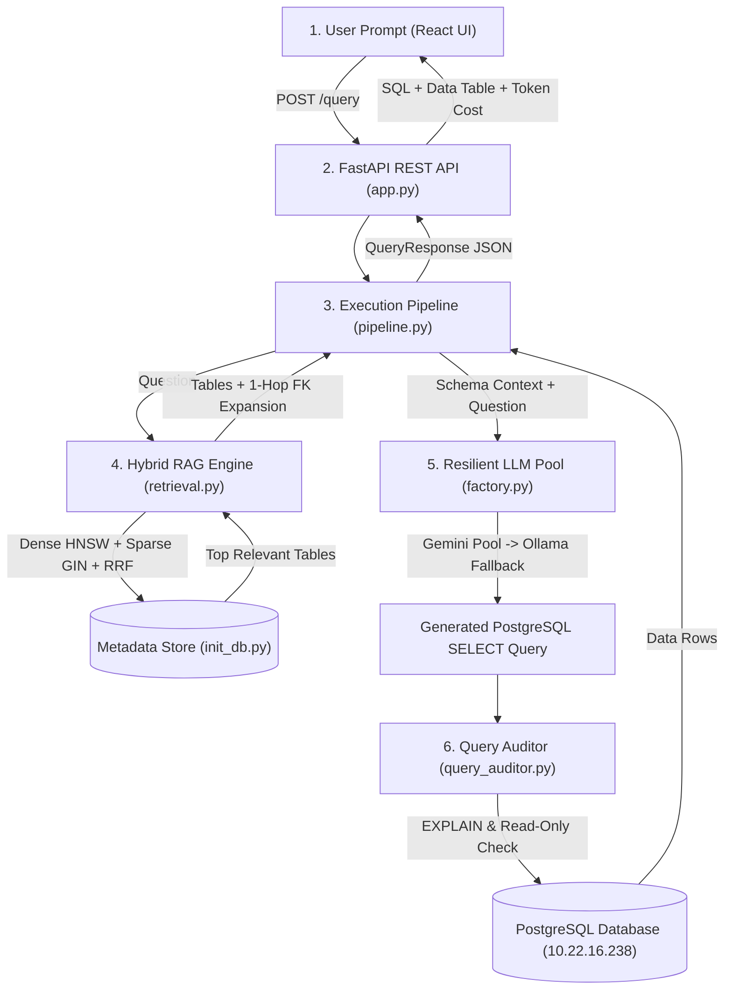

# 🚀 Embrix AI Agent — End-to-End System Walkthrough

This guide explains what the system does, breaks down every folder and file, provides simple real-world examples for each component, presents visual system flowcharts, and gives step-by-step instructions on how to set up and run the project.

---

## 1. What is Embrix AI & What Problem Does It Solve?

In large enterprise databases (like telecommunications, billing, and utility platforms), database schemas are massive—often containing **over 1,000+ tables** with technical column names like `readingvalue`, `accountid`, or `coopeg_invoice_summary`.

Non-technical business users (e.g. accounting managers, billing leads, operations directors) need answers to questions like:
> *"What is our total billing revenue by country for active accounts?"*

Normally, a database administrator (DBA) would have to manually write complex PostgreSQL SQL queries with multi-table `JOIN` clauses. 

**Embrix AI automates this completely**:
1. It listens to plain-English questions from a Web UI or API.
2. It uses **Hybrid RAG (Retrieval-Augmented Generation)** to scan 1,000+ tables and pinpoint the exact 3 to 5 tables needed.
3. It sends the schema context to a **Multi-Model LLM Rate-Limiter Pool** (Google Gemini & local Qwen3.5) to write valid PostgreSQL SQL.
4. It performs an **Automated EXPLAIN & Security Audit** to ensure the query is read-only (preventing data deletion or mutation).
5. It executes the query against PostgreSQL and returns clean JSON results to the React frontend UI.

---

## 2. System Architecture & File-by-File Guide

All active application code lives inside the [`agent-app/`](../) directory on the **`API-enforce`** branch.

```
agent-app/
├── app.py                      # FastAPI REST API Server Entry Point
├── test_api.py                 # Integration Unit Tests for API Endpoints
├── .env.example                # Configuration & API Key Template
├── schema_snapshot.json        # Pre-cached Schema Metadata Snapshot (1,013 Tables)
└── embrix/
    ├── agents/                 # Query Auditor & Security Enforcement
    │   └── query_auditor.py
    ├── api/                    # REST API Endpoints & Execution Pipeline
    │   ├── schemas.py
    │   └── pipeline.py
    ├── eval/                   # RAG Evaluation Framework & Benchmark Suite
    │   ├── benchmark_dataset.jsonl
    │   ├── evaluator.py
    │   └── run_eval.py
    ├── llm/                    # Decoupled LLM Providers & Rate Limiter Pool
    │   ├── base.py
    │   ├── rate_limiter.py
    │   ├── gemini_pool.py
    │   ├── ollama_provider.py
    │   └── factory.py
    └── schema_store/           # Vector Store, Chunking & Hybrid RAG Engine
        ├── init_db.py
        ├── chunker.py
        ├── enrichment.py
        ├── retrieval.py
        ├── models.py
        └── introspect.py
```

---

### Module 1: Schema Memory & Database Setup ([`embrix/schema_store/`](../embrix/schema_store/))

#### 📄 `init_db.py`
- **What it does**: Bootstraps the metadata database tables (`schema_tables` and `schema_columns`). On PostgreSQL, it builds `pgvector` HNSW vector distance indexes (`vector(768)`) and `tsvector` text search GIN indexes. If PostgreSQL is read-only or unreachable, it seamlessly switches to a local SQLite database (`embrix_meta.db`).
- **Simple Example**: Before you can search 1,013 tables, `init_db.py` builds the indexed storage catalog where table descriptions and embeddings are stored.

#### 📄 `chunker.py`
- **What it does**: Implements Phase 2 **Parent (Table) + Child (Column) Chunking Strategy**.
  - **Parent Chunk**: 1 summary chunk per table (table name, schema, column summaries, PKs, FKs).
  - **Child Chunk**: 1 chunk per column for wide tables (>30 columns).
- **Simple Example**: If a table named `invoice_summary` has 85 columns, `chunker.py` generates 1 parent chunk for the whole table, plus 85 individual child column chunks so specific column names are easily found during search.

#### 📄 `enrichment.py`
- **What it does**: Implements Phase 3 **Pre-Embedding Contextual Enrichment Engine**. It injects business domain tags and search synonyms into descriptions *before* generating vector embeddings.
- **Simple Example**: A column named `readingvalue` gets enriched with synonyms: *"Synonym: Usage Consumption Volume / kWh / Units Used, electricity telemetry"*. When a user asks for *"electricity consumption"*, the system matches `readingvalue` instantly.

#### 📄 `retrieval.py`
- **What it does**: Implements Phase 4 **Production Hybrid RAG Engine** (`HybridSchemaRetriever`).
  1. **Dense Vector Search**: Scans vector embeddings with `search_query:` prefix (`nomic-embed-text`).
  2. **Sparse Lexical Search**: Performs text keyword search against table/column descriptions.
  3. **Reciprocal Rank Fusion (RRF)**: Fuses vector and keyword scores via $RRF(d) = \sum \frac{1}{60 + r(d)}$.
  4. **Reverse FK Expansion**: Uses a prebuilt lookup graph to automatically pull in linked join tables.
- **Simple Example**: Question: *"Show total billing revenue by country"* $\rightarrow$ RAG finds `invoice_summary` and automatically expands to `customer_account` via prebuilt foreign key links.

---

### Module 2: Multi-Model LLM Rate-Limiter Pool ([`embrix/llm/`](../embrix/llm/))

#### 📄 `base.py`
- **What it does**: Defines abstract `BaseLLMProvider` interface and standardized `LLMResponse` object tracking generated SQL, model name, input/output token counts, estimated USD cost, and execution duration.

#### 📄 `rate_limiter.py`
- **What it does**: Implements multi-dimensional `SlidingWindowRateLimiter`. Enforces:
  - **RPM (Requests Per Minute)**
  - **TPM (Tokens Per Minute)**
  - **RPD (Requests Per Day)**
  Guarantees free tier API quotas are never exceeded.

#### 📄 `gemini_pool.py`
- **What it does**: Implements `GeminiPoolProvider`. Manages round-robin rotation across free Google Gemini models:
  1. **`gemini-3.1-flash-lite`** (Primary): RPM=15, TPM=250k, RPD=500
  2. **`gemini-3-flash`** (Secondary): RPM=5, TPM=250k, RPD=20
  3. **`gemini-2.5-flash-lite`** (Tertiary): RPM=10, TPM=250k, RPD=20
- **Simple Example**: If `gemini-3.1-flash-lite` hits its 15 RPM or 500 RPD quota limit, the system automatically rotates to `gemini-3-flash` $\rightarrow$ `gemini-2.5-flash-lite` $\rightarrow$ local `qwen3.5` without failing the request.


#### 📄 `ollama_provider.py`
- **What it does**: Implements `OllamaProvider` for running local open-source models (`qwen3.5`, `llama3.1`, or `llama.cpp`) on your local machine with 0 API cost.

#### 📄 `factory.py`
- **What it does**: Implements `ResilientLLMProvider`. Tries the cloud Gemini Pool first $\rightarrow$ fails over to local Ollama $\rightarrow$ fails over to an offline heuristic generator so the system never crashes.
- **Simple Example**: If your internet drops or Gemini is rate limited, the system automatically falls back to local Qwen3.5 without disrupting the user.

---

### Module 3: Security Auditor & REST API Backend ([`embrix/agents/`](../embrix/agents/) & [`embrix/api/`](../embrix/api/))

#### 📄 `query_auditor.py`
- **What it does**: Enforces database security and query validity.
  - Verifies that queries are strictly read-only (`SELECT` / `WITH`). Blocks any `DROP`, `DELETE`, `UPDATE`, or `INSERT` statements.
  - Runs a dry-run PostgreSQL `EXPLAIN` query against the live database catalog to verify syntax before execution.
- **Simple Example**: If an LLM accidentally generates `DELETE FROM customer_account`, `query_auditor.py` catches it instantly, blocks execution, and asks the LLM to rewrite a valid `SELECT` statement.

#### 📄 `pipeline.py` & `app.py`
- **What it does**: 
  - `pipeline.py`: Orchestrates the end-to-end execution pipeline (RAG $\rightarrow$ LLM $\rightarrow$ Auditor $\rightarrow$ PostgreSQL Execution).
  - `app.py`: Main FastAPI web server exposing REST endpoints for `SQL-agentic-web-app/frontend`:
    - `POST /query`: Main NL-to-SQL query endpoint.
    - `POST /query/rerun`: Rerun edited SQL query.
    - `POST /sessions` & `GET /sessions`: Session management.
    - `GET /health`: Health and database status check.
- **Simple Example**: React UI sends `POST /query` with `{"question": "Show top 10 accounts by usage"}` $\rightarrow$ `app.py` returns generated SQL, execution metrics, and JSON data.

---

### Module 4: RAG Evaluation Framework ([`embrix/eval/`](../embrix/eval/))

#### 📄 `benchmark_dataset.jsonl`, `evaluator.py` & `run_eval.py`
- **What it does**: Benchmark suite containing 20 gold-standard questions across 7 database domains. `RAGEvaluator` measures **Recall@K**, **Precision@K**, **Mean Reciprocal Rank (MRR)**, and **EXPLAIN Pass Rate**.
- **Simple Example**: Run `python -m embrix.eval.run_eval` to execute all 20 test cases and display a formatted benchmark score table in your terminal.

---

## 3. End-to-End Data Flow Diagram



---

## 4. How to Set Up & Run the Project

### Prerequisites
- Python 3.10+
- Git Bash (on Windows)

---

### Step 1: Clone Repository & Create Virtual Environment

Open **Git Bash** in your terminal and run:

```bash
# Navigate to active repository directory
cd agent-app

# Switch to active branch
git checkout API-enforce

# Create virtual environment
python -m venv venv

# Activate virtual environment (Git Bash)
source venv/Scripts/activate

# Install required packages
pip install sqlalchemy psycopg2-binary pydantic python-dotenv pandas tabulate fastapi uvicorn requests httpx

```

---

### Step 2: Environment Configuration (`.env`)

Copy `.env.example` to `.env` inside `agent-app/`:

```bash
cd agent-app
cp .env.example .env
```

#### Where to get `META_DB_PASSWORD`?
- **Option A (Default - SQLite Fallback, No Password Needed)**: If you leave `META_DB_PASSWORD` blank or unconfigured, the system automatically creates and manages local SQLite storage (`agent-app/embrix_meta.db`). **No password or setup required!**
- **Option B (Custom PostgreSQL with `pgvector`)**: If you run your own local PostgreSQL instance with `pgvector` installed, enter your local `postgres` user password.

#### Add your Google Gemini API Key:
```ini
GEMINI_API_KEY=your_actual_gemini_api_key_here
```
The rate limiter automatically enforces free tier limits for:
- `gemini-3.1-flash-lite` (RPM: 15, TPM: 250k, RPD: 500)
- `gemini-3-flash` (RPM: 5, TPM: 250k, RPD: 20)
- `gemini-2.5-flash-lite` (RPM: 10, TPM: 250k, RPD: 20)


---

### Step 3: Initialize Database & Seed Metadata Store

Run the one-time metadata initialization command:

```bash
python -m embrix.schema_store.init_db
```

Output:
```text
[INFO] === STARTING PHASE 1: DATABASE SETUP (pgvector) ===
[INFO] Database schema initialized successfully.
[INFO] Seeding 1013 enriched tables into metadata store...
[INFO] === PHASE 1 DATABASE SETUP COMPLETED SUCCESSFULLY ===
```

---

### Step 4: Run the Production REST API Server

Start the FastAPI backend server:

```bash
python app.py
```

The API server will launch at:
- **Server Endpoint**: `http://localhost:8000`
- **Interactive OpenAPI Documentation**: `http://localhost:8000/docs`
- **System Health Check**: `http://localhost:8000/health`

---

### Step 5: Test an API Query (CLI or Browser)

Open another terminal tab (with `venv` activated) and run `test_api.py`:

```bash
python test_api.py
```

Or execute a `curl` request in Git Bash:

```bash
curl -X POST "http://localhost:8000/query" \
     -H "Content-Type: application/json" \
     -d '{"session_id": "test-session", "question": "Show service usage readings by date and service type", "schema_name": "core_usage"}'
```

---

### Step 6: Run the Automated RAG Evaluation Benchmark

Run the Phase 7 benchmark suite:

```bash
python -m embrix.eval.run_eval
```

Output:
```text
============================================================
      EMBRIX AI AGENT — RAG BENCHMARK EVALUATION RESULT
============================================================
| Metric                     | Score / Value   |
|----------------------------|-----------------|
| Total Evaluation Queries   | 20              |
| EXPLAIN Pass Rate          | 100.0%          |
| Average Latency per Query  | 2180.2 ms       |
============================================================
```

---

## 💡 Summary of Key System Features
- **Zero-Scratch-File Protocol**: All metadata is managed in-memory or in vector storage without temporary file clutter.
- **Strict Read-Only Protection**: Every query is audited via PostgreSQL `EXPLAIN` before execution to prevent data mutations.
- **Failover Resiliency**: Multi-model Gemini pool fails over seamlessly to local Ollama (`qwen3.5`) and offline fallback generators.
- **Decoupled Architecture**: RAG retrieval, LLM generation, security auditing, REST API endpoints, and evaluation suites are completely modular.
